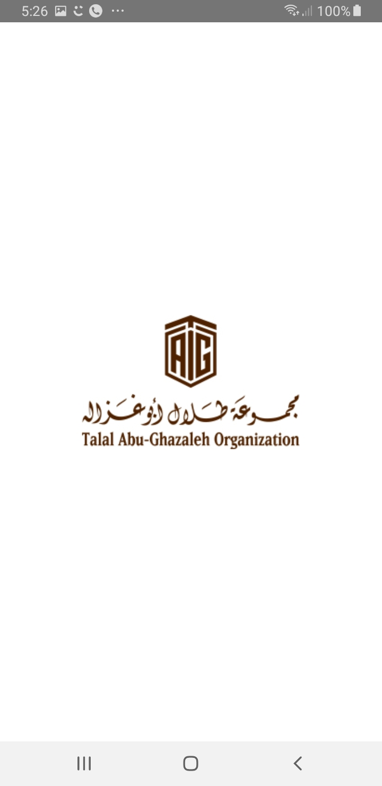
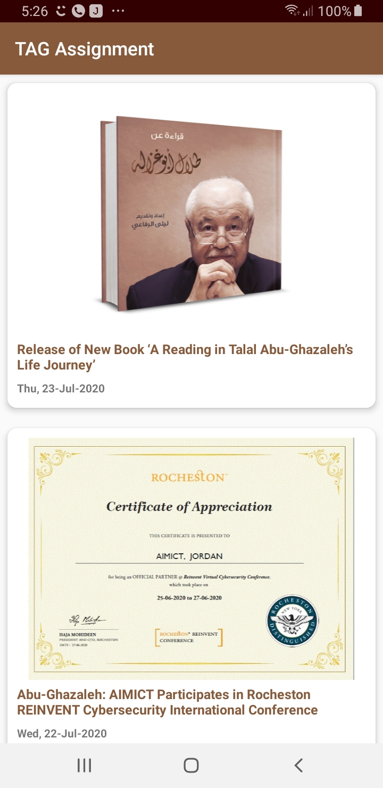

# TAGAssignment
This is my version of the assignment i was given
it has all basic requirments as well as all optional functions.

Features:
Used object oriented programming.

Used MVP architecture.

Retrives data from api using Retrofit.

Cache and save data using Room and DAO to reterive.

Glide library to cache images.

Butterknife Library to bind design with code.

Photozoom library to zoom news photo.

Splash screen with Talal Abu-Ghazaleh Logo.

Used Talal Abu-Ghazaleh website colors.

Retreive date from api and format it.

